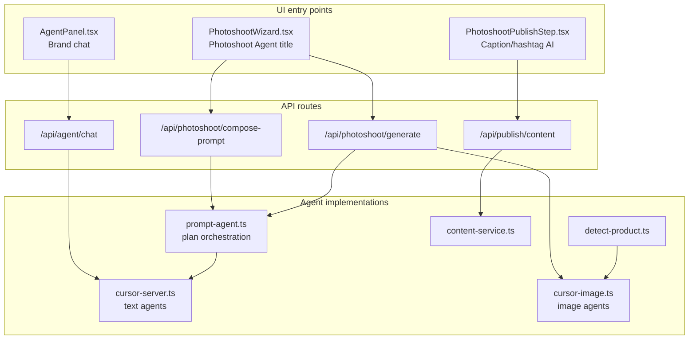

# Where Agents Live in the Codebase

This app uses the **Cursor SDK** (`@cursor/sdk`) in several places. There is no single “agent file” — agents are specialized by job (brand chat, photoshoot planning, image generation, product detection, publish copy) and wired through server libs, API routes, and UI components.

All agents share configuration from [`src/lib/cursor-server.ts`](../../src/lib/cursor-server.ts) via `getAgentOptions()` (reads `CURSOR_API_KEY` from `.env.local`).



---

## 1. Shared agent hub — `src/lib/cursor-server.ts`

Central place for **text-based** Cursor agents:

| Agent name | Function | Used for |
|---|---|---|
| **Ad AI Brand Agent** | `streamAgentResponse()` | Business DNA chat (streaming) |
| **Photoshoot Agent Director** | `composePhotoshootPromptWithCursor()` | Pro mode: writes isolation/scene/composite prompts (JSON) |
| **Photoshoot Research Analyst** | `researchPhotoshootContextWithCursor()` | Pro mode: deep research brief before planning |
| (unnamed one-shot) | `generateAssetBriefs()` | Campaign/photoshoot creative briefs |

All agents use the same API key and model via `getAgentOptions()`:

```typescript
export function getAgentOptions() {
  const apiKey = getCursorApiKey();
  return {
    apiKey,
    model: DEFAULT_MODEL, // composer-2.5
    local: { cwd: path.join(process.cwd()), settingSources: [] },
  };
}
```

---

## 2. Brand chat agent (sidebar “agent” UI)

| Layer | Path |
|---|---|
| UI | [`src/components/agent/AgentPanel.tsx`](../../src/components/agent/AgentPanel.tsx) |
| Mounted on | [`src/components/business-dna/OverviewPage.tsx`](../../src/components/business-dna/OverviewPage.tsx) |
| API | [`src/app/api/agent/chat/route.ts`](../../src/app/api/agent/chat/route.ts) |
| Server | `streamAgentResponse()` → **"Ad AI Brand Agent"** |
| Session state | `agentId` in [`src/lib/store.ts`](../../src/lib/store.ts) |

**Flow:** User types in `AgentPanel` → POST `/api/agent/chat` → `Agent.create` or `Agent.resume` → streamed text back via SSE.

---

## 3. Photoshoot “agent” (wizard + pipeline)

The wizard header **“Photoshoot Agent”** in [`src/components/photoshoot/PhotoshootWizard.tsx`](../../src/components/photoshoot/PhotoshootWizard.tsx) refers to the **photoshoot planning + generation stack**, not a single class.

### 3a. Text planning agents (prompts only)

| Layer | Path |
|---|---|
| Orchestrator | [`src/lib/photoshoot/prompt-agent.ts`](../../src/lib/photoshoot/prompt-agent.ts) |
| Pre-generate API | [`src/app/api/photoshoot/compose-prompt/route.ts`](../../src/app/api/photoshoot/compose-prompt/route.ts) |
| Generation | [`src/lib/photoshoot/generate.ts`](../../src/lib/photoshoot/generate.ts) |

Key functions:

- `composePhotoshootAgentPlan()` — calls **Photoshoot Agent Director** (or falls back to templates)
- `researchPhotoshootContext()` — calls **Photoshoot Research Analyst** (Pro only)
- Output type: `PhotoshootAgentPlan` (creative brief, isolation/scene/composite prompts, 10-step metadata)

**Modes:**

- **Pro:** research → `composePromptBundle()` → full 10-step studio pipeline
- **Standard:** template prompts + single-shot image agent (with deterministic fallback)

### 3b. Image agents (generate pixels)

| Layer | Path |
|---|---|
| Core | [`src/lib/image/cursor-image.ts`](../../src/lib/image/cursor-image.ts) — `runCursorGenerateImage()` |
| Wiring | [`src/lib/image/ai-composite.ts`](../../src/lib/image/ai-composite.ts), [`src/lib/photoshoot/generate.ts`](../../src/lib/photoshoot/generate.ts) |
| API | [`src/app/api/photoshoot/generate/route.ts`](../../src/app/api/photoshoot/generate/route.ts) |
| UI progress | [`src/components/photoshoot/PhotoshootGenerateStep.tsx`](../../src/components/photoshoot/PhotoshootGenerateStep.tsx) |

Each image call does `Agent.create({ name: agentName })` and instructs the agent to call **`generateImage` exactly once**:

| Agent name | Function | Pipeline step |
|---|---|---|
| Product Isolation Agent | `isolateProductWithCursor()` | remove BG (legacy; now mostly imgly) |
| Scene Background Agent | `generateSceneBackgroundWithCursor()` | AI backgrounds |
| AI Composite Agent | `compositeWithCursorAI()` | AI edit / relight |
| Pro Photoshoot Agent | `compositeWithCursorAI(singleImageMode)` | Standard quick single-shot |

---

## 4. Other agents

| Location | Agent name | Job |
|---|---|---|
| [`src/lib/photoshoot/detect-product.ts`](../../src/lib/photoshoot/detect-product.ts) | **Product Classifier** | Vision: detect product type from upload |
| [`src/lib/publish/content-service.ts`](../../src/lib/publish/content-service.ts) | **Ad AI Caption & Hashtag Strategist** | Publish step: captions, hashtags, SEO |
| [`src/lib/cursor-server.ts`](../../src/lib/cursor-server.ts) | (via `Agent.prompt`) | Asset brief generation |

Publish UI: [`src/components/photoshoot/PhotoshootPublishStep.tsx`](../../src/components/photoshoot/PhotoshootPublishStep.tsx) → `/api/publish/content`

---

## 5. What is NOT an agent

These paths are **local/deterministic** (no Cursor agent):

| Path | Technology | Job |
|---|---|---|
| [`src/lib/image/local-bg-removal.ts`](../../src/lib/image/local-bg-removal.ts) | `@imgly/background-removal-node` | Pixel-faithful background removal |
| [`src/lib/image/process-product.ts`](../../src/lib/image/process-product.ts) | `sharp` | Compositing fallback |
| [`src/lib/image/finish-pipeline.ts`](../../src/lib/image/finish-pipeline.ts) | `sharp` | Shadows, grade, DOF, export |

---

## 6. Quick “where do I look?” cheat sheet

| Goal | Start here |
|---|---|
| Chat agent | `AgentPanel.tsx` → `cursor-server.ts` → `streamAgentResponse` |
| Photoshoot prompt agent | `prompt-agent.ts` → `composePhotoshootPromptWithCursor` in `cursor-server.ts` |
| Agent that makes images | `cursor-image.ts` → `runCursorGenerateImage` |
| Pro research agent | `researchPhotoshootContextWithCursor` in `cursor-server.ts` → `runProStudioPhotoshoot` in `generate.ts` |
| Publish/caption agent | `content-service.ts` |
| `agentPlan` in UI | `PhotoshootWizard.tsx` state → `PhotoshootGenerateStep.tsx` |

---

## 7. Configuration

- **API key:** `.env.local` → `CURSOR_API_KEY` (see [`.env.example`](../../.env.example))
- **Status check:** [`src/app/api/cursor/status/route.ts`](../../src/app/api/cursor/status/route.ts) + [`src/lib/cursor-client.ts`](../../src/lib/cursor-client.ts)

> **Note:** [`AGENTS.md`](../../AGENTS.md) at the repo root is Next.js framework notes for the coding assistant — not your runtime agent definitions.

See also: [AI Integration Guide](./ai-integration.md)
